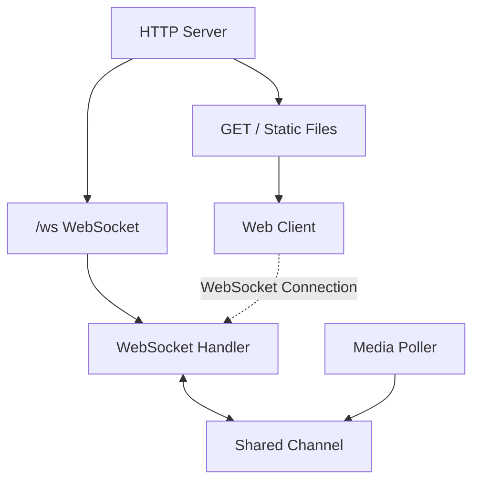

# 📘 Quazaar Project Documentation

Welcome to the comprehensive documentation for **Quazaar**, a real-time music player integration with WebSocket remote control for Linux.

## 🚀 Project Overview

Quazaar is a lightweight WebSocket-based remote control server for Linux with optional music/player integration (Spotify, MPRIS). It allows you to control your PC's media playback from any device on your network, view real-time track information, and execute secure commands.

**Key Features:**

- **Remote Command Execution**: Control your PC from any device.
- **Real-time Music Display**: Shows currently playing track with album artwork.
- **WebSocket Communication**: Fast, bidirectional communication.
- **Secure Command Allowlist**: Only pre-approved commands can be executed.
- **Modern Web Interface**: Clean, responsive UI.
- **Auto-updating Music Info**: Track information refreshes every 1 second.

---

## 🏗️ Architecture

Quazaar follows a modular architecture with a clear separation of concerns.

- **Main Server**: Handles HTTP requests and WebSocket upgrades.
- **Poller**: A background goroutine that continuously polls media player information (using `playerctl`) and broadcasts updates.
- **WebSocket Handler**: Manages real-time connections with clients.
- **Internal Modules**: Specialized packages for Auth, Spotify, Fileshare, etc.

---

## 📂 Project Structure

The project is organized as follows:

- **`cmd/`**: Application entry points.
  - `server/`: Main server application.
- **`internal/`**: Private application code.
  - `api/`: HTTP API routers and handlers.
  - `auth/`: Authentication logic (middleware, handlers).
  - `db/`: Database interactions (SQLite).
  - `fileshare/`: File sharing functionality.
  - `media/`: Media player integration (MPRIS, Spotify).
  - `middleware/`: HTTP middleware (Auth).
  - `player/`: Player control logic.
  - `poller/`: Media polling system.
  - `spotify/`: Spotify-specific integration.
  - `system/`: System utilities (WiFi, Bluetooth).
  - `websocket/`: WebSocket implementation.
- **`pkg/`**: Public reusable libraries.
  - `helpers/`: Utility functions.
  - `models/`: Data models.
- **`docs/`**: Project documentation.
- **`temp/web/`**: Frontend assets (HTML/JS).

For a detailed breakdown, see [Project Structure Guide](architecture/project-structure.md).

---

## 🗺️ The Journey

This section documents the development journey of Quazaar, highlighting key milestones, challenges, and solutions.

### Phase 1: Authentication System

The initial focus was on securing the application. We moved from an open system to a secure, token-based authentication model.

- **Plan**: [Authentication Completion Plan](dump/AUTH_COMPLETION_PLAN.md) - The roadmap for securing the app.
- **System Design**: [Auth System Documentation](architecture/auth-system.md) - Technical details of the implementation.
- **Outcome**: Implemented user registration, login, and token management.

### Phase 2: Implementation & Flow

Once auth was planned, we moved to implementation, ensuring a smooth flow for users and developers.

- **Checklist**: [Implementation Checklist](dump/IMPLEMENTATION_CHECKLIST.md) - Tracking the progress of features.
- **Flow**: [Complete Flow](dump/COMPLETE_FLOW.md) - Visualizing the user and data flow.

### Phase 3: Testing & Fixes

A critical phase where we identified and fixed major issues, particularly around authentication and API stability.

- **Fixes**: [Fix Summary](dump/FIX_SUMMARY.md) - Detailed report on fixing the 401 Unauthorized issue.
- **Recheck**: [Recheck Report](dump/RECHECK_REPORT.md) - Verification of fixes.
- **Testing Setup**: [Testing Setup Guide](guides/testing-setup.md) - How to set up the testing environment.

### Phase 4: Improvements & Refinement

After the core features were stable, we focused on code quality and user experience.

- **Improvements**: [Improvement Guide](dump/IMPROVEMENT_GUIDE.md) - Suggestions and plans for future enhancements.
- **Visuals**: [Visual Guide](guides/visuals.md) - UI/UX design documentation.

### Phase 5: Releases

We follow a semantic versioning approach. Check the changelogs for detailed release notes.

- **Latest**: [v0.1.4 Changelog](changelog/CHANGELOG_v0.1.4.md) - Introducing Secure File Sharing.
- **History**: See the `docs/changelog/` directory for past releases.

---

## 🧩 Features & Modules

### WebSocket System

The core of Quazaar's real-time capabilities.

- [WebSocket Documentation](features/websocket.md)

### Media Poller

The engine that keeps track info up-to-date.

- [Poller Documentation](features/poller.md)

### Spotify Integration

Dedicated integration for Spotify users.

- [Spotify Readme](features/spotify.md)

### Android Fileshare

Securely transfer files between devices.

- [Android Fileshare Guide](features/android-fileshare.md)

---

## 👩‍💻 Developer Guide

### Setup

To get started with development:

1. **Prerequisites**: Go 1.16+, `playerctl`.
2. **Clone**: `git clone ...`
3. **Build**: `go build -o quazaar ./cmd/server`
4. **Run**: `./quazaar`

See [Testing Setup](guides/testing-setup.md) for detailed instructions.

### Contributing

We welcome contributions! Please read our [Contributing Guide](../CONTRIBUTING.md) before submitting a PR.

---

_Documentation generated on December 4, 2025._
