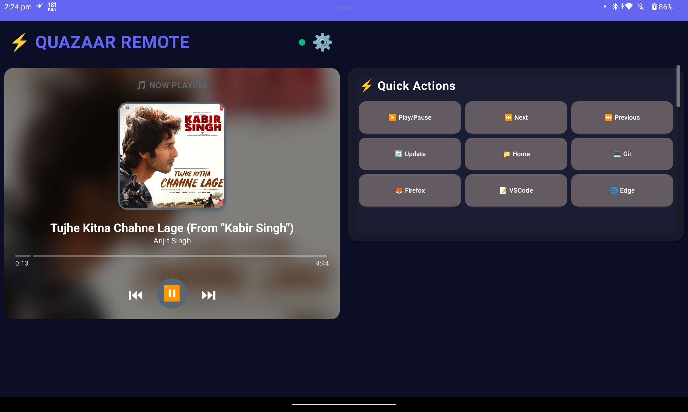
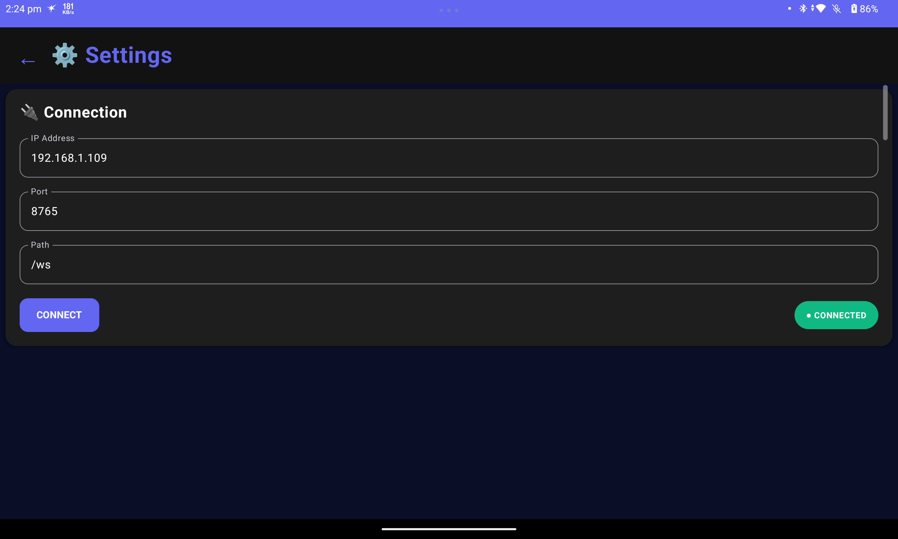

# Quazaar Android App - v0.1.0-beta

**Official Android client for Quazaar media control server**

[Download APK v0.1.0-beta](https://github.com/codershubinc/QuazaarApp/releases/download/v0.1.0-beta/Quazaar_v0.1.0-beta.apk)



## 📱 Overview

The Quazaar Android app provides a mobile interface to control your media playback remotely. Connect to your Quazaar server over WiFi or internet to control music, view system information, and manage Spotify playback.

## ✨ Features

### Media Control

- ▶️ Play/Pause toggle
- ⏭️ Next track
- ⏮️ Previous track
- 📊 Real-time playback status
- 🎵 Track information display
- 🖼️ Album artwork viewing

### Spotify Integration

- 🎧 Spotify account connection
- 👤 User profile viewing
- 📱 Device management
- 🎼 Current playback display
- ❤️ Artist following

### System Information

- 📶 WiFi status and details
- 🔵 Bluetooth device listing
- 💻 Server connectivity status

### Real-time Updates

- 🔄 WebSocket connection for live updates
- 📡 Instant playback state changes
- 🔔 Server notifications

## 🚀 Getting Started

### Prerequisites

1. **Quazaar Server Running**

   - Server version: v0.0.1.3 or higher
   - Server accessible on your network
   - User account created on server

2. **Android Device**
   - Android 7.0 (API 24) or higher
   - Internet/WiFi connection
   - Storage permission for cache

### Installation

1. **Download APK**

   ```
   Download: [quazaar-v0.1.0-beta.apk](https://github.com/codershubinc/QuazaarApp/releases/download/v0.1.0-beta/Quazaar_v0.1.0-beta.apk)
   Size: ~19-22 MB
   ```

2. **Enable Installation from Unknown Sources**

   - Go to Settings → Security
   - Enable "Unknown Sources" or "Install from Unknown Sources"
   - (Android 8.0+: Grant permission per-app)

3. **Install APK**
   - Open the downloaded APK file
   - Tap "Install"
   - Wait for installation to complete
   - Tap "Open" or find "Quazaar" in your app drawer

### First-Time Setup

1. **Launch the App**

   - Open Quazaar from your app drawer

2. **Connect to Server**

   - Enter server IP address (e.g., `192.168.1.100`)
   - Enter server port (default: `8765`)
   - Tap "Connect" or "Save"

3. **Login**

   - Enter your username
   - Enter your password
   - Tap "Login"

4. **Grant Permissions (if needed)**
   - Storage permission (for caching artwork)
   - Network permission (already granted)

## 🔧 Configuration

### Server Connection

#### Local Network (Same WiFi)

```
Server IP:   192.168.1.100
Server Port: 8765
Protocol:    HTTP
```

#### Remote Connection (Internet)

```
Server IP:   your.domain.com or public_ip
Server Port: 8765
Protocol:    HTTP (HTTPS recommended for production)
```

### Finding Your Server IP

**On Linux Server:**

```bash
# Get local IP
ip addr show | grep "inet " | grep -v 127.0.0.1

# Or
hostname -I
```

**On Android (same network):**

- Connect to same WiFi as server
- Server IP usually starts with 192.168.x.x or 10.0.x.x

### Connection Settings

The app stores:

- Server address
- Server port
- Authentication token
- Last connection state

Settings are persisted across app restarts.

## 📖 User Guide

### Home Screen


**Top Section:**

- Server connection status indicator
- Current user display
- Settings button

**Playback Section:**

- Album artwork
- Track title
- Artist name
- Album name
- Playback position/duration

**Controls:**

- Previous button
- Play/Pause button
- Next button

**Bottom Navigation:**

- Home
- Spotify
- System
- Settings

### Player Controls

#### Play/Pause

- Tap the center play button to toggle playback
- Real-time status updates via WebSocket

#### Skip Tracks

- Tap Next (⏭️) to skip to next track
- Tap Previous (⏮️) to go to previous track

#### Track Information

- Swipe up for more details
- View full metadata
- See playback queue (if available)

### Spotify Features

#### Connect Spotify Account

1. Go to Spotify tab
2. Tap "Connect Spotify"
3. Login via browser (redirects to Spotify OAuth)
4. Authorize the app
5. Redirects back to app

#### View User Profile

- Displays Spotify username
- Shows account type (Free/Premium)
- Profile image
- Country information

#### Device Selection

- View all available Spotify devices
- Select device for playback
- See active device indicator

#### Artist Information

- View currently playing artist
- See artist followers count
- Follow/Unfollow artists
- View artist genres

### System Information

#### WiFi Status

- Network name (SSID)
- IP address
- Signal strength
- Connection status

#### Bluetooth Devices

- List of paired devices
- Connected device indicator
- Device names and addresses

## 🔐 Authentication

### Login Process

The app uses token-based authentication:

1. **User enters credentials**

   - Username: Your server username
   - Password: Your server password

2. **App requests token**

   ```
   POST /api/v0.1/login
   {
     "username": "your_username",
     "password": "your_password"
   }
   ```

3. **Server returns deviceId token**

   ```json
   {
     "success": true,
     "token": "$2a$10$...",
     "tokenType": "deviceId",
     "username": "your_username"
   }
   ```

4. **Token stored securely**
   - Saved in SharedPreferences
   - Used for all subsequent API calls
   - Included as `deviceId` query parameter

### API Request Format

All authenticated requests include the token:

```
GET /api/v0.1/player/info?deviceId=YOUR_TOKEN
GET /api/v0.1/spotify/user?deviceId=YOUR_TOKEN
POST /api/v0.1/player/play-pause?deviceId=YOUR_TOKEN
```

### Settings Screen



**Available Options:**

- Server configuration
- User account information
- Spotify connection status
- App version and build info
- Logout button

### Logout

- Tap Settings → Logout
- Clears stored token
- Returns to login screen
- Closes WebSocket connection

## 🌐 Network Requirements

### Ports

- **8765** - Default Quazaar server port
- **Required open on server firewall**

### Protocols

- **HTTP** - API communication
- **WebSocket (WS)** - Real-time updates

### Firewall Configuration (Server)

**Linux (ufw):**

```bash
sudo ufw allow 8765/tcp
sudo ufw reload
```

**Linux (iptables):**

```bash
sudo iptables -A INPUT -p tcp --dport 8765 -j ACCEPT
```

### Router Configuration (Remote Access)

For internet access, configure port forwarding:

1. Access router admin panel
2. Forward external port 8765 → internal server IP:8765
3. Use dynamic DNS if you don't have static IP

## 📱 App Architecture

### Technology Stack

- **Language:** Kotlin/Java
- **UI:** Android XML layouts / Material Design
- **Networking:** Retrofit / OkHttp
- **WebSocket:** OkHttp WebSocket
- **JSON:** Gson / Moshi
- **Image Loading:** Glide / Picasso

### API Endpoints Used

**Authentication:**

- `POST /api/v0.1/login`
- `POST /api/v0.1/signup`

**Player:**

- `GET /api/v0.1/player/info`
- `POST /api/v0.1/player/play-pause`
- `POST /api/v0.1/player/next`
- `POST /api/v0.1/player/previous`

**Spotify:**

- `GET /api/v0.1/spotify/login`
- `GET /api/v0.1/spotify/callback`
- `GET /api/v0.1/spotify/user`
- `GET /api/v0.1/spotify/devices`
- `GET /api/v0.1/spotify/artist`
- `POST /api/v0.1/spotify/artist/follow`

**System:**

- `GET /api/v0.1/system/wifi`
- `GET /api/v0.1/system/bluetooth`

**WebSocket:**

- `WS /ws?deviceId=YOUR_TOKEN`

## 🐛 Troubleshooting

### Cannot Connect to Server

**Check:**

1. Server is running: `ps aux | grep quazaar`
2. Both devices on same network
3. Correct IP address entered
4. Firewall allows port 8765
5. Server logs show no errors

**Test Connection:**

```bash
# From Android device (using Termux or SSH)
curl http://SERVER_IP:8765/api/v0.1/player/info

# Expected: JSON response or 401 Unauthorized (normal without token)
```

### Login Failed

**Common Issues:**

- Wrong username/password
- Server database not initialized
- No user registered on server

**Solution:**

```bash
# On server - verify user exists
sqlite3 ~/.quazaar/quazaar.db "SELECT * FROM users;"

# Create user if needed
curl -X POST http://localhost:8765/api/v0.1/signup \
  -H "Content-Type: application/json" \
  -d '{"username":"admin","password":"password123"}'
```

### WebSocket Connection Drops

**Causes:**

- Network instability
- Server restart
- App backgrounded (Android battery optimization)

**Solutions:**

- Keep app in foreground
- Disable battery optimization for Quazaar
- Check network stability
- App auto-reconnects on return

### Spotify Not Connecting

**Requirements:**

1. User added to Spotify app allowlist (developer.spotify.com)
2. Valid Spotify client ID and secret on server
3. Correct redirect URI configured
4. Server has internet access

**Check Server Logs:**

```bash
# Server should show OAuth flow
# Look for "Spotify authentication successful"
```

### No Album Artwork

**Possible Causes:**

- No artwork URL from player
- Network issues
- Storage permission denied
- Image loading error

**Solutions:**

- Grant storage permission
- Check network connection
- Restart app

## 🔒 Security & Privacy

### Data Storage

- Credentials: Encrypted SharedPreferences
- Token: Secure local storage
- No data sent to third parties
- No analytics or tracking

### Network Security

- **Development:** HTTP (localhost/LAN)
- **Production:** HTTPS recommended
- Token transmitted in requests
- No sensitive data logged

### Permissions Required

**Internet** - Required

- API communication
- WebSocket connection

**Network State** - Required

- Check connectivity
- Handle offline state

**Storage** (Optional)

- Cache artwork
- Save app data

## 📋 Changelog

### v0.1.0-beta (Initial Release)

**Features:**

- ✅ Server connection management
- ✅ User authentication
- ✅ Media player controls
- ✅ Spotify integration
- ✅ System information display
- ✅ WebSocket real-time updates
- ✅ Material Design UI

**Known Issues:**

- WebSocket may disconnect when app backgrounded
- Limited offline functionality
- No notification controls yet
- Settings UI minimal

## 🚧 Roadmap (Future Versions)

### v0.2.0

- [ ] Notification controls
- [ ] Background playback monitoring
- [ ] Widget support
- [ ] Dark theme
- [ ] Queue management

### v0.3.0

- [ ] Multiple server support
- [ ] Server discovery (mDNS/Bonjour)
- [ ] Offline mode
- [ ] Local cache
- [ ] Better error messages

### v1.0.0

- [ ] Google Play release
- [ ] Material You theming
- [ ] Tablet layout optimization
- [ ] Advanced settings
- [ ] Backup/restore settings

## 📞 Support & Feedback

### Report Issues

- [GitHub Issues](https://github.com/codershubinc/Quazaar/issues)
- Email: support@quazaar.dev (if available)

### Feature Requests

- Submit via GitHub Issues
- Tag with "enhancement"
- Describe use case

### Community

- [Documentation](https://github.com/codershubinc/Quazaar/docs)
- Discussions: GitHub Discussions

## 🔗 Related Resources

- [Server Setup Guide](./CREATE_USER_ON_SERVER.md)
- [API Documentation](../API_TESTING_GUIDE.md)
- [Spotify Integration](../../internal/spotify/SPOTIFY_INTEGRATION.md)
- [Server Source Code](https://github.com/codershubinc/Quazaar)
- [Android App Source Code](https://github.com/codershubinc/QuazaarApp)

## 📄 License

**MIT License**

Copyright © 2025 Swapnil Ingle

---

**Version:** v0.1.0-beta  
**Release Date:** November 2025  
**Platform:** Android 7.0+  
**Server Compatibility:** Quazaar v0.0.1.3+
