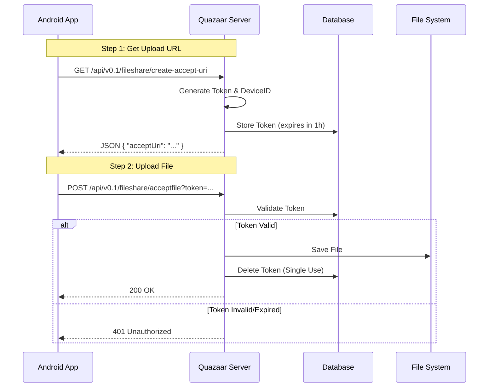

# Android File Share Implementation Guide

This guide details the steps to implement the file sharing functionality in the Quazaar Android application, mirroring the logic used in the web test client.

## Overview

The file sharing process involves two main steps:
1.  **Requesting an Upload URL:** The client asks the server for a temporary, one-time-use URL to upload a file.
2.  **Uploading the File:** The client uploads the file content to the received URL using a `POST` request with `multipart/form-data`.

### Architecture Flow



## API Endpoints

### 1. Create Accept URI
*   **Endpoint:** `/api/v0.1/fileshare/create-accept-uri`
*   **Method:** `GET` (Note: The web test used `GET`, ensure consistency with backend) or `POST` depending on server implementation. *Correction based on web test:* The web test uses `GET`.
*   **Response:** JSON
    ```json
    {
      "acceptUri": "http://<server_ip>:<port>/api/v0.1/fileshare/acceptfile?token=..."
    }
    ```

### 2. Upload File
*   **Endpoint:** The `acceptUri` received from the previous step.
*   **Method:** `POST`
*   **Content-Type:** `multipart/form-data`
*   **Body:**
    *   Key: `file`
    *   Value: File content (Binary)

## Implementation Steps for Android (Kotlin/Java)

### Step 1: Dependencies
Ensure you have a networking library (like Retrofit or OkHttp) and a way to handle file selection.

**Recommended Libraries:**
*   **OkHttp:** For efficient HTTP requests and file uploads.
*   **Retrofit:** (Optional) For structured API calls.

### Step 2: Define the API Interface (Retrofit Example)

```kotlin
interface FileShareApi {
    @GET("/api/v0.1/fileshare/create-accept-uri")
    suspend fun getUploadUrl(): Response<UploadUrlResponse>
}

data class UploadUrlResponse(
    @SerializedName("acceptUri") val acceptUri: String
)
```

### Step 3: Implement File Selection
Use the Android System File Picker to allow the user to select a file.

```kotlin
// In your Activity or Fragment
val pickFileLauncher = registerForActivityResult(ActivityResultContracts.GetContent()) { uri: Uri? ->
    uri?.let { fileUri ->
        // Proceed to upload with this URI
        startUploadProcess(fileUri)
    }
}

// Trigger selection
pickFileLauncher.launch("*/*") // Or specific mime types
```

### Step 4: The Upload Logic (OkHttp Example)

This function handles both getting the URL and uploading the file with progress tracking.

```kotlin
fun uploadFile(context: Context, fileUri: Uri, serverBaseUrl: String) {
    val client = OkHttp.Builder().build()

    // 1. Get the Upload URL
    val requestUrlRequest = Request.Builder()
        .url("$serverBaseUrl/api/v0.1/fileshare/create-accept-uri")
        .get()
        .build()

    client.newCall(requestUrlRequest).enqueue(object : Callback {
        override fun onFailure(call: Call, e: IOException) {
            // Handle error
        }

        override fun onResponse(call: Call, response: Response) {
            val responseBody = response.body?.string()
            val json = JSONObject(responseBody)
            val uploadLink = json.getString("acceptUri")

            // 2. Upload the File to the link
            uploadContent(context, uploadLink, fileUri)
        }
    })
}

fun uploadContent(context: Context, uploadUrl: String, fileUri: Uri) {
    val contentResolver = context.contentResolver
    val type = contentResolver.getType(fileUri) ?: "application/octet-stream"
    
    // Create a RequestBody that supports progress (Custom implementation needed for progress)
    val fileRequestBody = object : RequestBody() {
        override fun contentType() = type.toMediaTypeOrNull()
        
        override fun contentLength(): Long {
            // Calculate file size from URI
            return -1 // Or actual size
        }

        override fun writeTo(sink: BufferedSink) {
            contentResolver.openInputStream(fileUri)?.use { source ->
                sink.writeAll(source.source())
            }
        }
    }

    val multipartBody = MultipartBody.Builder()
        .setType(MultipartBody.FORM)
        .addFormDataPart("file", "filename", fileRequestBody)
        .build()

    val request = Request.Builder()
        .url(uploadUrl)
        .post(multipartBody)
        .build()

    OkHttpClient().newCall(request).enqueue(object : Callback {
        override fun onFailure(call: Call, e: IOException) {
            // Handle upload failure
        }

        override fun onResponse(call: Call, response: Response) {
            if (response.isSuccessful) {
                // Handle success
            } else {
                // Handle server error
            }
        }
    })
}
```

### Step 5: Progress Tracking (Crucial for UX)
To show speed and percentage like the web client, you need to wrap the `RequestBody`.

1.  Create a `ProgressRequestBody` class that extends `RequestBody`.
2.  Override `writeTo` to count bytes written and update a listener.
3.  Calculate speed: `bytesWritten / timeElapsed`.
4.  Calculate ETA: `(totalBytes - bytesWritten) / speed`.

### Step 6: UI Updates
*   Show a "Requesting..." state when fetching the URL.
*   Show a Progress Bar during upload.
*   Display "Speed", "ETA", and "Size" text views updated by the progress listener.
*   Handle "Success" and "Error" states with Toasts or Snackbars.

## Checklist
- [ ] Permission: `READ_EXTERNAL_STORAGE` (if targeting older Android versions).
- [ ] Network Security Config: Allow cleartext traffic if testing on local LAN (HTTP).
- [ ] Large File Handling: Ensure streams are used to avoid OOM errors.
- [ ] Background Upload: Consider using `WorkManager` for large files to prevent interruption if the app is closed.
