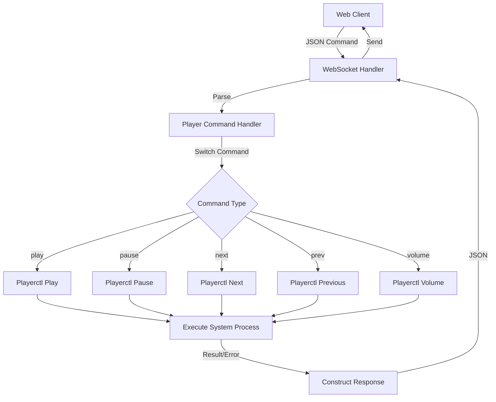

# Player Commands Documentation

## Overview

The player command system allows WebSocket clients to control media playback through a set of well-defined commands. Commands are received as JSON messages from the browser and processed by the `utils/player` package.

---

## Architecture



```
Client (Browser)
    │
    ├─ JSON: {"command": "player_toggle"}
    │
    ▼
WebSocket Handler (handler.go)
    │
    ├─ Parse message
    ├─ Check for "command" field
    │
    ▼
Player Command Handler (player/commands.go)
    │
    ├─ HandlePlayerCommand(msg)
    │  └─ Match command string
    │
    ▼
Playerctl Execution
    │
    ├─ Play/Pause/Next/Prev
    ├─ Volume Control
    ├─ Seek Position
    │
    ▼
Response Sent Back (WebSocket)
    └─ {"status": "success", "message": "command_executed", "data": {...}}
```

---

## Available Commands

### 1. Play

**Command**: `"play"`

```json
{
  "command": "play"
}
```

**Description**: Starts media playback
**Playerctl**: `playerctl play`
**Logs**: `▶️  Play`

### 2. Pause

**Command**: `"pause"`

```json
{
  "command": "pause"
}
```

**Description**: Pauses media playback
**Playerctl**: `playerctl pause`
**Logs**: `⏸️  Pause`

### 3. Toggle Play/Pause

**Command**: `"player_toggle"` (or `"play-pause"`)

```json
{
  "command": "player_toggle"
}
```

**Description**: Toggles between play and pause states
**Playerctl**: `playerctl play-pause`
**Logs**: `🔄 Toggle Play/Pause`
**Use Case**: Used by the media player UI play/pause button

### 4. Next Track

**Command**: `"next"`

```json
{
  "command": "next"
}
```

**Description**: Skips to the next track
**Playerctl**: `playerctl next`
**Logs**: `⏭️  Next Track`

### 5. Previous Track

**Command**: `"prev"`

```json
{
  "command": "prev"
}
```

**Description**: Plays the previous track
**Playerctl**: `playerctl previous`
**Logs**: `⏮️  Previous Track`

### 6. Volume Up

**Command**: `"volume_up"`

```json
{
  "command": "volume_up"
}
```

**Description**: Increases volume by 5%
**Playerctl**: `playerctl volume 0.05+`
**Logs**: `🔊 Volume Up`
**Range**: 0.0 to 1.0 (0% to 100%)

### 7. Volume Down

**Command**: `"volume_down"`

```json
{
  "command": "volume_down"
}
```

**Description**: Decreases volume by 5%
**Playerctl**: `playerctl volume 0.05-`
**Logs**: `🔉 Volume Down`
**Range**: 0.0 to 1.0 (0% to 100%)

### 8. Stop

**Command**: `"stop"`

```json
{
  "command": "stop"
}
```

**Description**: Stops media playback
**Playerctl**: `playerctl stop`
**Logs**: `⛔ Stop`

---

## Advanced Commands (Programmable)

### Seek to Position

**Function**: `Seek(seconds int64)`

```go
Seek(120)  // Seek to 2 minutes
```

**Playerctl**: `playerctl position 120`
**JSON Format**: Not directly exposed, but can be added
**Use Case**: Progress bar click to seek

### Seek Relative

**Function**: `SeekRelative(seconds int64)`

```go
SeekRelative(10)   // Forward 10 seconds
SeekRelative(-5)   // Backward 5 seconds
```

**Playerctl**: `playerctl position +10` or `playerctl position -5`
**Use Case**: Fast forward/rewind buttons

---

## Message Flow

### Request (Browser → Server)

```json
{
  "command": "player_toggle"
}
```

### Server Processing

```
1. WebSocket receives message
2. Check if "command" field exists
3. Call player.HandlePlayerCommand(msg)
4. Match command string
5. Execute playerctl subprocess
6. Capture result/error
7. Send response back
```

### Response (Server → Browser)

**Success**:

```json
{
  "status": "success",
  "message": "command_executed",
  "data": {
    "command": "player_toggle"
  }
}
```

**Error**:

```json
{
  "status": "error",
  "message": "command_failed",
  "data": {
    "error": "exit status 127: playerctl not found"
  }
}
```

---

## Implementation Details

### HandlePlayerCommand Function

```go
func HandlePlayerCommand(cmdData map[string]interface{}) error {
    command, ok := cmdData["command"].(string)
    if !ok {
        return fmt.Errorf("invalid command format")
    }

    switch command {
    case "play":
        return Play()
    case "pause":
        return Pause()
    case "player_toggle":
        return TogglePlayPause()
    // ... more cases
    default:
        return fmt.Errorf("unknown command: %s", command)
    }
}
```

### Error Handling

- Invalid command format → Returns error
- Unknown command → Returns error with command name
- Playerctl not found → Returns error from subprocess
- Player not running → Playerctl returns error
- All errors logged with emoji indicators

### Logging

Each command logs its execution:

- **Start**: Icon + action (e.g., `▶️  Play`)
- **Success**: ✅ Confirmation
- **Error**: ❌ Error message

**Log Example**:

```
🎮 Executing player command: player_toggle
🔄 Toggle Play/Pause
✅ Toggle successful
```

---

## Browser Integration (Future)

### UI Controls Needed

```html
<!-- Play/Pause Button -->
<button onclick="sendCommand({command: 'player_toggle'})">▶️ / ⏸️</button>

<!-- Next/Previous -->
<button onclick="sendCommand({command: 'next'})">⏭️ Next</button>
<button onclick="sendCommand({command: 'prev'})">⏮️ Previous</button>

<!-- Volume -->
<button onclick="sendCommand({command: 'volume_up'})">🔊</button>
<button onclick="sendCommand({command: 'volume_down'})">🔉</button>

<!-- Stop -->
<button onclick="sendCommand({command: 'stop'})">⛔ Stop</button>
```

### JavaScript Helper

```javascript
function sendCommand(command) {
  if (ws && ws.readyState === WebSocket.OPEN) {
    ws.send(JSON.stringify(command));
  }
}
```

---

## Error Scenarios

### Scenario 1: Player Not Running

```
Command: play
Error: playerctl not found or no player running
Response: {"status": "error", "message": "command_failed", ...}
```

### Scenario 2: Unknown Command

```
Command: unknown_cmd
Error: unknown command: unknown_cmd
Response: {"status": "error", "message": "command_failed", ...}
```

### Scenario 3: Invalid Format

```
Command: {} (no "command" field)
Error: invalid command format
Response: {"status": "error", "message": "command_failed", ...}
```

### Scenario 4: Success

```
Command: player_toggle
Playerctl: Executes successfully
Response: {"status": "success", "message": "command_executed", ...}
```

---

## Supported Players

Playerctl supports any MPRIS-compatible media player:

- ✅ Spotify
- ✅ VLC
- ✅ MPV
- ✅ Rhythmbox
- ✅ GNOME Music
- ✅ KDE Elisa
- ✅ And many more...

---

## File Structure

```
Quazaar/
├─ utils/
│  └─ player/
│     └─ commands.go         ← Command handlers
└─ utils/websocket/
   └─ handler.go             ← Integrates commands
```

---

## Future Enhancements

1. **Seek Command**: Allow progress bar seeking

   ```json
   { "command": "seek", "seconds": 120 }
   ```

2. **Get Command Status**: Query current state

   ```json
   { "command": "get_status" }
   ```

3. **Set Volume**: Direct volume setting

   ```json
   { "command": "set_volume", "level": 0.75 }
   ```

4. **Shuffle/Repeat**: Playlist controls

   ```json
   { "command": "shuffle", "enabled": true }
   ```

5. **Playlist Navigation**: Jump to specific track
   ```json
   { "command": "goto_track", "index": 3 }
   ```

---

## Testing

### Manual Test

1. Open browser WebSocket client
2. Send command: `{"command": "player_toggle"}`
3. Check response: `{"status": "success", ...}`
4. Verify music plays/pauses in player

### Log Output

```
🎮 Processing command: player_toggle
🎮 Executing player command: player_toggle
🔄 Toggle Play/Pause
✅ Toggle successful
```

### Multi-Client Scenario

- Client 1 sends: `player_toggle`
- Media info broadcasts to all clients
- All clients see updated playback status
- UI updates simultaneously

---

## Summary

The player command system provides:

- ✅ Simple JSON-based command interface
- ✅ 8 basic commands (play, pause, next, prev, volume, stop)
- ✅ Error handling and logging
- ✅ WebSocket integration
- ✅ Response feedback to clients
- ✅ Extensible architecture for future commands
- ✅ Support for all MPRIS-compatible players

**Status**: 🟢 Production Ready!
